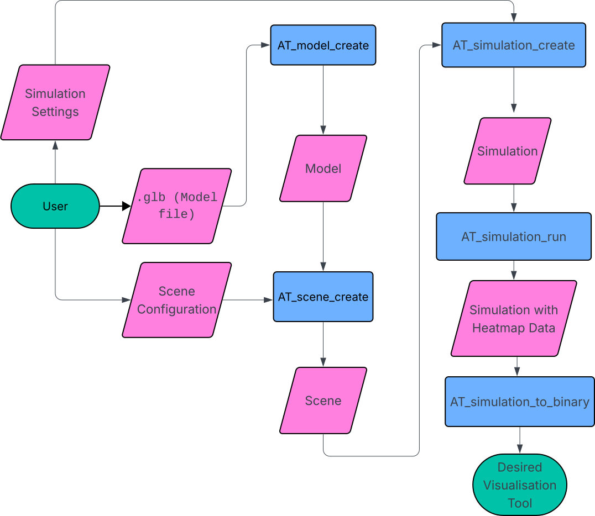

# Acoustic Tracer

GitHub Repository Link: [Acoustic Tracer](https://github.com/Acoustic-Resonance/AcousticTracer)

Team Members:

- Alex Wright - Simulation Core / Front-end
- Patryk Mrozek - Simulation Core
- Eoghan Murphy - Simulation Core / Optimization
- Michael McCarthy - Front-end

## Table of Contents

- Introduction

Our project 'Acoustic Tracer' is a three-dimensional, acoustic visualiser that allows users to visualise sound travelling throughout a modelled environment as a heat map. At the core it is a C library, where the user can read in a `.glb` file (3D Model File), insert (a) speaker(s), specify simulation settings, and receive back a heat map of how the sound travelled through the environment over time. Our final project extends it into a web-based application that renders this heat map and makes the configuration of the scene and simulation more user-friendly, while also allowing more technical users to achieve their desired configuration. A user can create an account, upload `.glb` model files, view the models in a 3D scene-viewer, configure the scene and simulation settings, and finally run the simulation, returning a heat map which they can play through and replay at a later time if desired. The aim of this project was to create a unique software that could be used by architects, acoustic specialists, or anyone who desires to model how sound travels through their environment. This was also a passion project to explore the potential and concept of ray-tracing, along with creating a software that people would actually use.

- Previous Works

 <!-- TODO -->
On carrying out research into existing technologies before starting this project, we weren't able to find an exact software to meet our needs.

- Overview of ours (basically the presentation)
- architecture (front & back)

Upon starting the project our first task was to set up the shared GitHub repository where our code was to be hosted. This was an involved process with the whole team, as we wanted to ensure a proper workflow with professional version control standards. We set up an organisation, as to not have a single person hosting the repository. We then created the repository `AcousticTracer` where we each forked it, giving ourselves a personal 'copy' of the repository to serve as our `origin`. We then added a remote `upstream` where we could merge changes from our personal forks to the original repository located in the organisation. This allowed us to each work independently on features in parallel and then push these changes into a shared repository. We configured approval rules to ensure that members could not approve their own pull requests, and that each pull request required at least one approval before merging into the main branch.

Once the GitHub had been configured the next step was to work on the C library specification, since that is the core essence of the project. The C Library will henceforth be referred to as the 'core' of the project. The members working on the core of the project began at the 'top' of the core, creating the specification and outline of the public API presented by the core to the end user. Our initial scope of the project included a 'command buffer' that the output would be written do. The idea behind the command buffer was that the output of the simulation would be instructions for any graphics engine (OpenGL, Vulkan, etc.), on how to draw our heat map. This was in the hopes to create a truly independent, graphics library agnostic library, but this was later scrapped due to the complexity. We settled on creating a consistent communication standard instead, that could be parsed by any front-end, or visualization tool. This communication standard will be discussed at a later stage.

The architecture / workflow we envisioned for the user was as follows:



The core of the project was written in C, over other languages, for a few key reasons. Firstly, C is extremely performant, which is crucial for our application since it is extremely computationally heavy. A key feature for us was the library `raylib` which C provides as an external library, and this allowed us to visualise our core during development. Finally we have been using dynamically typed languages such as Python and JavaScript during our degree, and we wanted to each improve our programming skills with a statically typed language. Since C is devoid of object-oriented features like classes and methods, the workflow for our C library must follow a certain structure. The user of the C library must create `struct` instances and pass these to functions that alter them. However users of the included front-end need not worry about the implementation. Each of the functions, `structs`, and data types that are publicly available to the end user are forward declared in the file `at.h` which the user of our library can include in their project. This file includes all the function signatures, along with `struct` member descriptions to make it easy for the user to understand the data flow, as well as the use of our library. These forward declarations are fully defined in `at_internal`, or in their own respective `at_*.c` files, as to abstract the implementation away from the user.

The specification of the project involved the design of the following structures and data-types (each prefixed with `AT_` as part of our core library (Acoustic Tracer)):

The front-end, as mentioned is our method of creating a universal visualiser for the heat map of the model, while remaining platform agnostic (i.e. usable on MacOS, Linux, Windows, iOS, Android, etc.). Initially, during the project specification phase, we designed a communication standard which we stuck with throughout the duration of the project, and it worked well. However, while the structure of the data remained the same, the data type had to change, which will be discussed later. We decided to create a server in C, that exposed an endpoint `/run` to the user, where they can send the scene and simulation configuration, and receive the heat map data as the server response. The front-end, could then make a HTTP request to the server which is easily performed on any language.

## Simulation


Our core C library, as mentioned, involves the simulation of sound as rays throughout a three-dimensional environment. This implementation involves two main steps:

1. Ray Bounce Tree
2. DDA (Digital Differential Analyser) Voxel Sweep

#### Rays

A ray, for our purposes in this project, is a 3D representation of a line that extends infinitely from a source point (represented as a three-dimensional vector `{x, y, z}`), in a given direction (also represented as a three-dimensional vector `{dx, dy, dz}`, where each of the components is the change of the position along the x, y, and z axes, respectively).

Our first step in the implementation of the project was to emit rays from the 'speaker' (which will be hereby referred to as the 'source'). Let's assume for the moment that we have the scene configuration and the simulation configuration which are defined as follows:

```C
typedef struct {
  const AT_Source *sources;
  uint32_t num_sources;
  AT_MaterialType material;
  const AT_Model *environment;
} AT_SceneConfig;

typedef struct {
    AT_Vec3 position;
    AT_Vec3 direction;
} AT_Source;
```

Where the `environment` is the `struct` of the 3D model the user specifies, and the source is composed of a position and direction (similar to the vector). We initialise rays using `AT_ray_init()` at the position of the source, setting their initial direction and position to those of the source they come from. Since we then want to create a realistic simulation of how these rays interact (bounce, scatter, and absorb) throughout the environment, we must implement each phenomena associated with these 'sound rays'.

The first phenomena of the rays we implemented was reflection. This is where a ray 'bounces' off a surface, creating a new ray with an origin of the point of intersection of the surface, and a 'reflected' direction. Before we implemented reflection, we first had to implement the intersection between a ray and a triangle. Since our model is composed of entirely triangles, it is important to define what it means for a ray to intersect with a triangle.

This is where we used the Möller-Trumbmore ray/triangle intersection algorithm[^1]. This allows us to compute whether a ray intersects with a triangle without having to pre-compute the plane equation of the plane containing the triangle.

Once we were able to get whether a ray intersected with a triangle, the next issue was to handle what actually happens when the ray intersects with the triangle. Initially we implemented a `hit_list` which was given to each ray, that tracked each point on any triangle that the ray intersected with. We must keep track of every single point of intersection, and then only 'handle' the point of intersection closest to the ray origin, as this would be the 'first' intersection, regardless of the order of the triangle checks. This caused problems with memory management, which is important in C. Since we didn't know until runtime, how many times a ray would intersect with any of the triangles, we didn't know how big to make the `hit_list` array. This introduced the concept of the dynamic array, which functions like lists do in Python and JavaScript, where the size of the list increases, if appending an element exceeds the capacity of the list. Once we had computed the closest point of intersection of each ray, we could then initialise a new ray with the origin of the point of intersection and the 'reflected' direction.

To combat the memory management associated with the `hit_list` approach of calculating the closest point of intersection, we pivoted to using a linked list approach for the ray implementation. Each ray would have a `child` ray that is the resultant ray after intersection, scattering, reflection etc. Upon the first intersection of a ray we would initialise a new ray with the computed origin and direction, and only update its direction and origin upon subsequent intersections, only if the distance from that point of intersection was less than the distance from the current rays origin to its child. This greatly simplified the computation, while also introducing an hierarchy among the rays, with a parent/child relationship. We could also easily navigate this ray hierarchy using linked list traversal methods.

### voxel stuff

Phase two of the simulation. A voxel is a volumetric pixel, and in our case, a voxel is a dynamic array defined as follows:

```C
typedef struct {
    float *items;
    size_t count;
    size_t capacity;
} AT_Voxel;
```

This structure allows us to use our general purpose dynamic array functionality defined in `at_utils.h`. `items` is a pointer to an array of floats, which we call "bins".

In this phase, a voxel grid stores the spatial distribution of sound energy across the scene. The size of the voxels is user-specified, this size determines the resolution of the simulation. Smaller voxels produce a more detailed heat map but require significantly more memory and computation. The world dimensions of the voxel grid are calculated by subtracting the max and min value of the scenes AABB, which is the smallest possible box that encapsulates the entire model. These world dimensions are then used to calculate the grid dimensions by dividing the world dimensions by the user-specified voxel size, which gives `grid_x`, `grid_y` and `grid_z`. Rather than allocating a 3-dimensional matrix, the voxel grid is stored in a 1-dimensional array of `AT_Voxel` types. A voxel at position (x, y, z) in the grid can be accessed using the formula `z * grid_y * grid_x + y * grid_x + x`. A contiguous block of memory is more efficient to allocate and iterate over than nested pointers.

Every ray generated in the first phase of the simulation is then traversed using the Digital Differential Analyzer (DDA) algorithm, implemented with reference to Amanatides and Woo's *A Fast Voxel Traversal Algorithm for Ray Tracing* algorithm [ref]. A naive approach to this problem might sample points along a ray at fixed intervals, but this risks skipping voxels entirely if they are only grazed by a ray, and also opens up the possibility for a voxel to be visited multiple times. The DDA algorithm allows us to track how far along a ray segment we need to travel to cross the next voxel boundary per axis, which is tracked by the variable `t_max`. At each step, the axis with the smallest `t_max` is advanced. This guarantees that every voxel the ray segment passes through is visited exactly once, regardless of the ray's direction or the size of the voxels.

For each voxel the ray crosses, an amount of energy is deposited into that voxel. This energy deposit is weighted by three physical factors. First, the length of the ray segment inside the voxel, a ray travelling a longer path through a voxel contributes more energy to it. Second, inverse square attenuation with total distance `d` from the source, modelling how sound naturally loses intensity over distance. Third, air absorption, modelled as `exp(-k * d)`, where `k` is the air coefficient, which accounts for energy lost to the medium itself as the 'wave' propagates.

The current time of the simulation `t` is calculated as `d / v` where `v` is the current simulation speed. Throughout the development of this project, `v` was one of two values. First being 343 m/s, which is the speed of sound, and an arbitrary slower speed that was used while building the visualisation, to make the movement of the sound energy through heat map easier to observe. The current "bin" index is then calculated with `floor(t / bin_width)`, where `bin_width = 1 / fps`. This is the design decision that makes the output a temporal result rather than a static energy snapshot. Each voxel records how much energy arrived, as well as when it arrived. Each voxel's bin array grows dynamically since at allocation time the duration of the simulation is not yet known.

### C Library

### Frontend

## Introduction and Motivation

The AcousticTracer project pairs a C simulation engine with a browser-based frontend, which configures, stores, and visualises the simulation. Tools like ODEON exist for this domain, but they are desktop-only, expensive, and closed-source. A browser-based alternative would be freely accessible, require no installation, and immediate real-time use. This section describes the architecture of that browser frontend: what its major components are, how they interact at runtime, and what was learned building this project while starting with little to no prior experience in Three.js, WebGL, or production React architecture.

### Core Goals

The frontend has three responsibilities, each with distinct technical demands:

1. **Configure and submit** — The user uploads a `.glb` 3D room model, sets simulation parameters (voxel size, ray count, FPS, surface material), and interactively places a sound source by clicking inside the 3D scene. The configuration is sent to the C backend as JSON.

2. **Decode and store** — The C backend returns simulation results as a custom binary format (`.atrb`). The frontend must decode this into typed arrays, store it in cloud file storage for persistent storage, and cache the parsed result so revisiting a completed simulation is instantaneous.

3. **Render and replay** — The decoded frames must be visualised as a 3D voxel heat map overlaid on the room model, animated at the simulation's original FPS. A typical simulation produces tens of thousands to hundreds of thousands of voxels, each requiring per-frame position and color updates. This must run at interactive frame rates in a browser, with a fully functioning playback system.

- Design choices (front)
  - state storing
  - storing (not state)
  - rendering
  - replaying
  - auth
  - routing

- What we would do different (ODEON)
- Lessons learned
- Future Feature Plans
- Conclusions [^1]
- references

## References

[^1]: [Möller-Trumbore Intersection Algorithm](https://en.wikipedia.org/wiki/M%C3%B6ller%E2%80%93Trumbore_intersection_algorithm)

### C

- Implementation
  - Two phase simulation:
    - Rays
      - Moller-Trumbmore alg, linked list/tree structure of rays, absorption...
    - Voxels
      - DDA, energy bins design, voxel grid, attenuation...
- Design choices (c library)
  - at.h, opaque API, at_internal.h, returning AT_Result...
- Optimisation

- API comms (both, potent split into two sections)
  - bins
